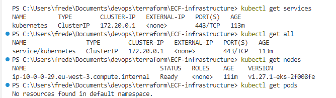
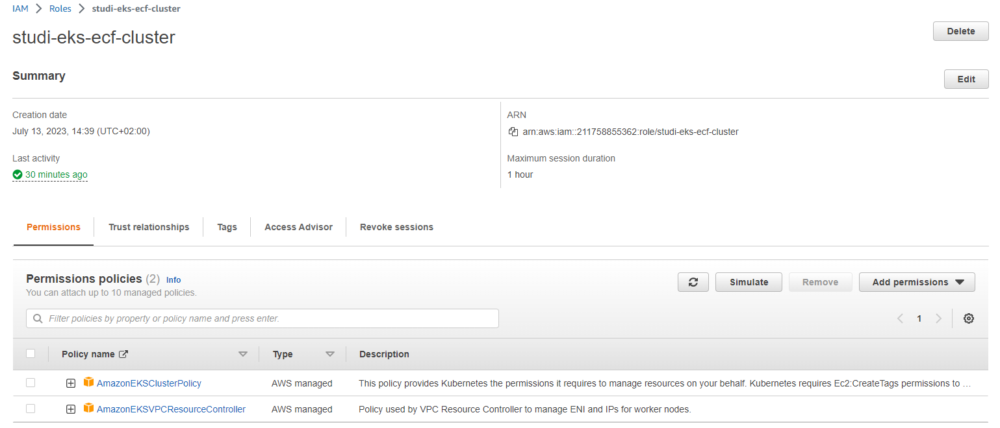
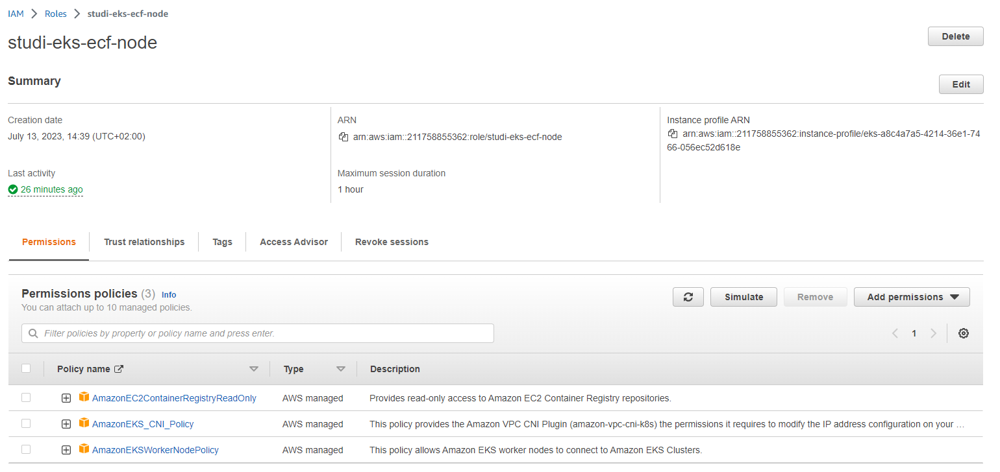
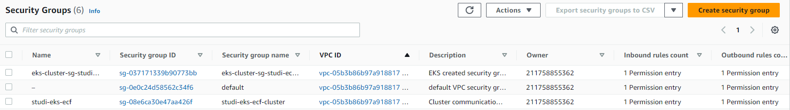
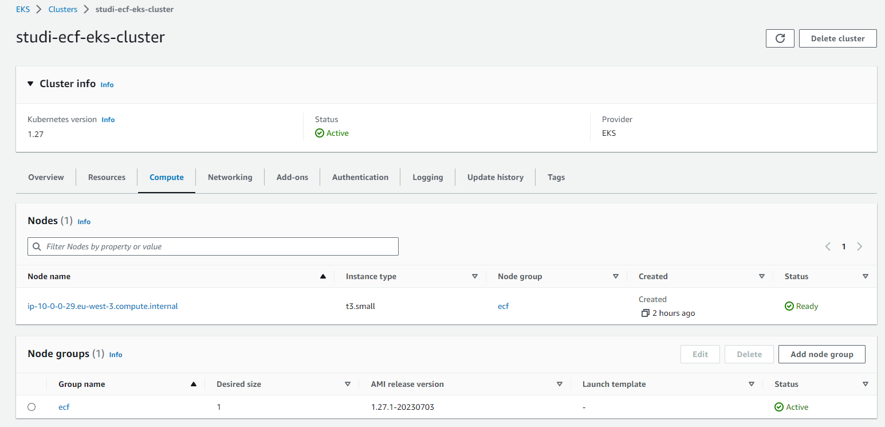
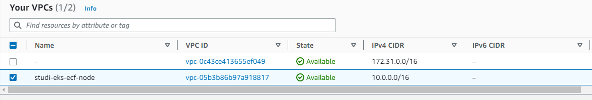
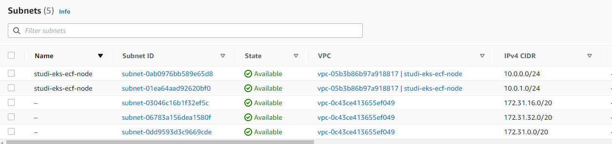
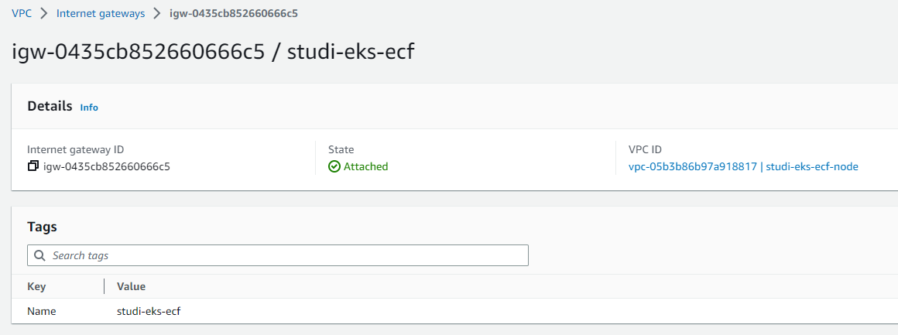
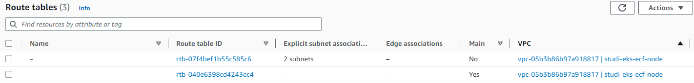
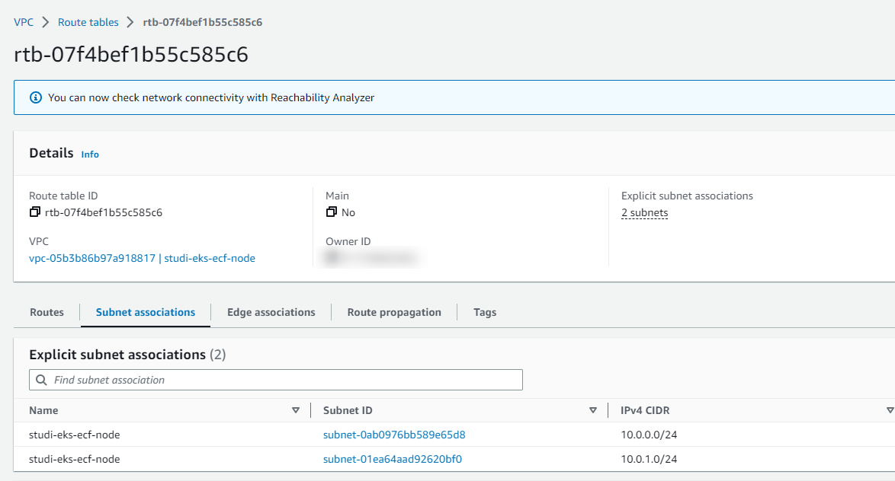

- [ECF-infrastructure](#ecf-infrastructure)
  - [Activité Type 1 : Automatisation du déploiement d’infrastructure dans le Cloud](#activité-type-1--automatisation-du-déploiement-dinfrastructure-dans-le-cloud)
    - [1. Préparez un kube kubernetes en utilisant Terraform (3 points).](#1-préparez-un-kube-kubernetes-en-utilisant-terraform-3-points)
      - [1.1 Création de l'IAC](#11-création-de-liac)
      - [1.2 Process création de l'infrastructure](#12-process-création-de-linfrastructure)
      - [1.3 Interactions avec kubectl](#13-interactions-avec-kubectl)
      - [1.4 Ressources créées dans AWS](#14-ressources-créées-dans-aws)
    - [2. Ajoutez/configurez les variables d’environnement qui se connectent à la BDD (3 points).](#2-ajoutezconfigurez-les-variables-denvironnement-qui-se-connectent-à-la-bdd-3-points)
    - [Sources utilisées](#sources-utilisées)

# ECF-infrastructure  

[Planning Notion](https://mirror-paw-f24.notion.site/f2fa7cecae5a4cd4a1792bf963ec744a?v=b71bd3754f5541c1a7c1a23cbb2f1ca9)  

## Activité Type 1 : Automatisation du déploiement d’infrastructure dans le Cloud  

### 1. Préparez un kube kubernetes en utilisant Terraform (3 points).  

#### 1.1 Création de l'IAC

Tous ces fichiers sont créés dans un même dossiers.  

- [variables.tf](variables.tf)  
  - variable : aws_region
  - variable : cluster_name
- [providers.tf](providers.tf)  
  - provider : aws
- [eks-cluster.tf](eks-cluster.tf)  
  - ressource : aws_iam_role
  - ressource : aws_iam_role_policy_attachment
  - ressource : aws_iam_role_policy_attachment
  - ressource : aws_security_group
  - ressource : aws_security_group
  - ressource : aws_security_group_rule
  - ressource : aws_eks_cluster
- [eks-worker-nodes.tf](eks-worker-nodes.tf)  
  - ressource : aws_iam_role
  - ressource : aws_iam_role_policy_attachment
  - ressource : aws_iam_role_policy_attachment
  - ressource : aws_iam_role_policy_attachment
  - ressource : aws_eks_node_group
- [vpc.tf](vpc.tf)  
  - ressource : aws_vpc
  - ressource : aws_subnet
  - ressource : aws_internet_gateway
  - ressource : aws_route_table
  - ressource : aws_route_table_association
- [workstation-external-ip.tf](workstation-external-ip.tf)  
- [outputs.tf](outputs.tf)  

#### 1.2 Process création de l'infrastructure

✔ Prérequis : avoir installé terraform sur sa machine locale : [Install Terraform](https://developer.hashicorp.com/terraform/downloads)  
Les commandes ci dessous sont utilisées (dans l'ordre) pour créer l'infrastructure sur aws :  
```
terraform init # Initialise le dossier de travail avec les fichiers de configuration de terraform
terraform plan #  Création d'un plan d'exécution / Prévisualisation avant terraform apply
terraform apply # Création de l'infrastructure / Exécution des actions listées dans terraform plan
terraform destroy # Déstruction de toutes les ressources créées
```

#### 1.3 Interactions avec kubectl

✔ Prérequis : pour pouvoir communiquer avec notre Kube, il faut copier la sortie générée par `terraform apply` (sur le modèle donné par [outputs.tf](outputs.tf)) et la coller dans la configuration de kubectl (**~/.kube/config** sous Linux ou **%USERPROFILE%\.kube\config** sous Windows)

```
kubectl get svc # Lister tous les services
kubectl get all # Lister toutes les ressources
kubectl get nodes # Lister tous les nodes (un seul créé)
kubectl get pods # Lister tous les pods créés (aucun à la création de l'infra)
```
  

#### 1.4 Ressources créées dans AWS
- IAM Roles **studi-eks-ecf-cluster** avec 2 policies affectées :  
    
- IAM Roles **studi-eks-ecf-node** avec 3 policies affectées :  
    

- Security Groups / 
    
- aws_security_group_rule  

- Le Cluster **studi-ecf-eks-cluster**, le node group **ecf** et le node créé à partir d'une instance t3.small


- VPC **studi-eks-ecf-node**
   

- 2 subnets **studi-eks-ecf-node**  
  

 - Internet gateways
    

- Route tables 
    

 - Route table association  
    


### 2. Ajoutez/configurez les variables d’environnement qui se connectent à la BDD (3 points).  

### Sources utilisées
Ressources utilisées :

[Terraform - Provision an EKS Cluster (AWS)](https://developer.hashicorp.com/terraform/tutorials/kubernetes/eks)  
[Terraform - Resource: aws_eks_cluster](https://registry.terraform.io/providers/hashicorp/aws/latest/docs/resources/eks_cluster)  
[Terraform - Resource: aws_eks_node_group](https://registry.terraform.io/providers/hashicorp/aws/latest/docs/resources/eks_node_group)  
[Terraform - Resource: aws_iam_policy](https://registry.terraform.io/providers/hashicorp/aws/latest/docs/resources/iam_policy)  
[Github - terraform-provider-aws](https://github.com/hashicorp/terraform-provider-aws)  
[AWS - Creating an Amazon EKS cluster](https://docs.aws.amazon.com/eks/latest/userguide/create-cluster.html)  
[AWS - Creating a VPC for your Amazon EKS cluster](https://docs.aws.amazon.com/eks/latest/userguide/creating-a-vpc.html)  
[Youtube - How to provision AWS EKS using Terraform](https://www.youtube.com/watch?v=KsvfV5iuWqM)  
[Youtube - EKS cluster using management console - Part 1](https://www.youtube.com/watch?v=kDTr3IJfawY)  
[Youtube - EKS cluster using management console - Part 2](https://www.youtube.com/watch?v=IHdWJhMGdXA)  
[Youtube - EKS cluster using management console - Part 3](https://www.youtube.com/watch?v=0amRQQnwwAk)  
 
